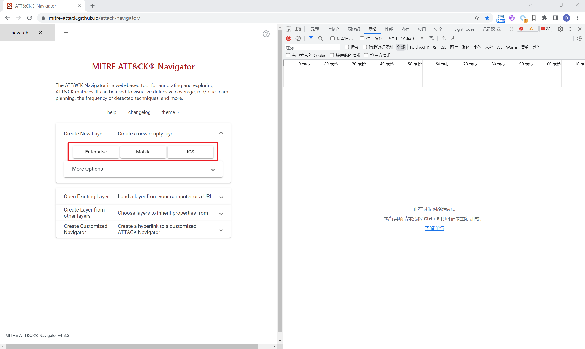

> 文章ID：A003	
>
> 创建时间：2023-06-12
>
> 更新时间：2023-06-12
>
> 状态：废弃

> 有更好地方式获取ATT&CK DataBase

> 能够从 https://mitre-attack.github.io/attack-navigator/ 获取到ATT&CK Matrix 的Json数据，里面存储了Tactics、Techniques、Software等关联数据信息。下面简单整理了一下json的数据结构，和使用方法。

# 如何获取attack-navigator中的Json数据

1. 访问 https://mitre-attack.github.io/attack-navigator/ 打开浏览器``` dev-tool``` 并选择需要查看的矩阵领域

   

   

2. 在```dev-tool``` 中选择 ```网络>enterprise-attack.json``并在新标签页中打开

   > 此处以Enterprise为例

   

3. 将json数据另存为

   

# 数据结构

## Objects 对象

关联数据在```objects```对象中，对象值为列表，列表中的每个元素包含了ATT&CK数据新。其样例如下：

```json
 {
      "x_mitre_domains": [
        "enterprise-attack"
      ],
      "object_marking_refs": [
        "marking-definition--fa42a846-8d90-4e51-bc29-71d5b4802168"
      ],
      "id": "course-of-action--00d7d21b-69d6-4797-88a2-c86f3fc97651",
      "type": "course-of-action",
      "created": "2018-10-17T00:14:20.652Z",
      "created_by_ref": "identity--c78cb6e5-0c4b-4611-8297-d1b8b55e40b5",
      "external_references": [
        {
          "source_name": "mitre-attack",
          "url": "https://attack.mitre.org/mitigations/T1174",
          "external_id": "T1174"
        },
        {
          "url": "https://msdn.microsoft.com/library/windows/desktop/ms721766.aspx",
          "description": "Microsoft. (n.d.). Installing and Registering a Password Filter DLL. Retrieved November 21, 2017.",
          "source_name": "Microsoft Install Password Filter n.d"
        }
      ],
      "modified": "2019-07-25T11:22:19.139Z",
      "name": "Password Filter DLL Mitigation",
      "description": "Ensure only valid password filters are registered. Filter DLLs must be present in Windows installation directory (<code>C:\\Windows\\System32\\</code> by default) of a domain controller and/or local computer with a corresponding entry in <code>HKEY_LOCAL_MACHINE\\SYSTEM\\CurrentControlSet\\Control\\Lsa\\Notification Packages</code>. (Citation: Microsoft Install Password Filter n.d)",
      "x_mitre_deprecated": true,
      "x_mitre_version": "1.0",
      "x_mitre_modified_by_ref": "identity--c78cb6e5-0c4b-4611-8297-d1b8b55e40b5"
    }
```


