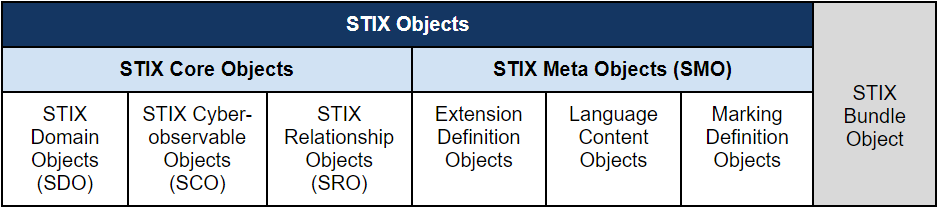
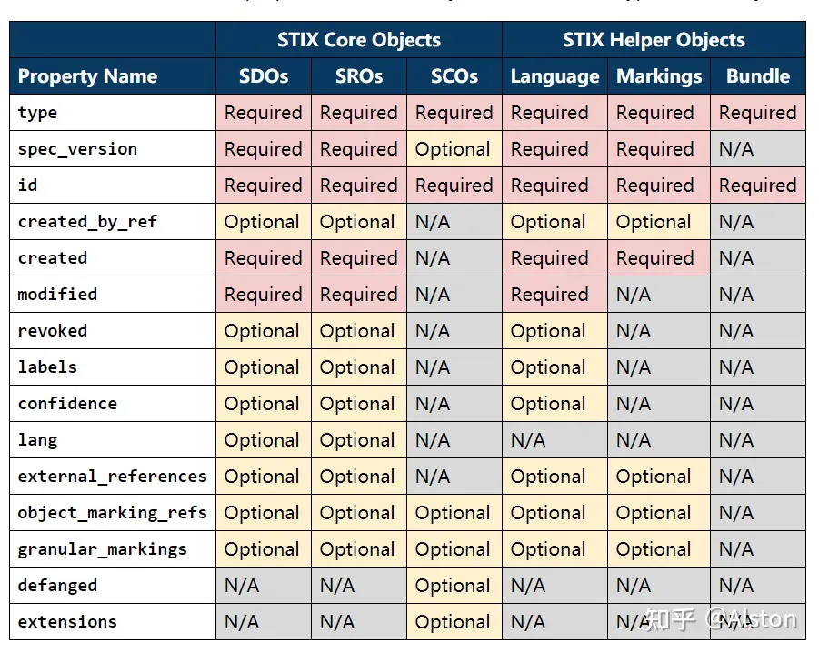
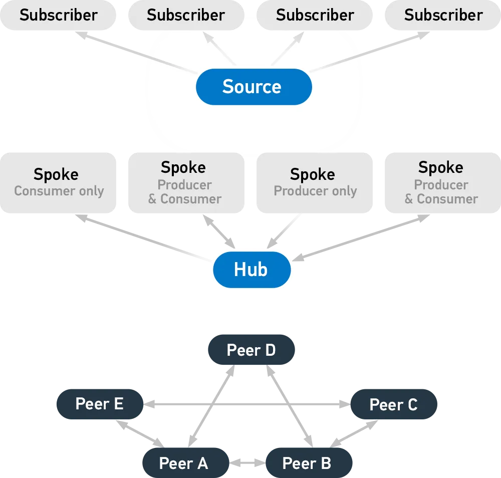

> 文章 ID：A005
>
> 创建时间：2023-06-13
>
> 更新时间：2023-06-13

> 文献资料：
>
> https://oasis-open.github.io/cti-documentation/
>
> https://www.oasis-open.org/committees/tc_home.php?wg_abbrev=cti
>
> https://www.anomali.com/resources/what-are-stix-taxii
>


# 简介

STIX/TAXII是由对威胁情报共享标准的需要而开发的。

STIX和TAXII是标准，旨在改进网络攻击的预防和缓解。STIX规定了“威胁情报的内容”，而TAXII定义了“信息如何传递”。与以前共享信息的方法不同，STIX和TAXII是机器可读的，因此易于自动化。

STIX/TAXII旨在通过以下方式改善安全措施：

- 扩展当前威胁情报共享的能力
- 在响应与主动检测之间取得平衡
- 促进综合考虑威胁情报

# STIX

>  能够对网络威胁进行表述和建模的一种语言


​	STIX,即结构化威胁信息表达(Structured Threat Information Expression),是由MITRE和OASIS Cyber Threat Intelligence (CTI) Technical Committee共同开发的一种标准化语言，用于描述网络安全威胁信息。它已被多个情报共享社区和组织采用为国际标准。设计初衷是通过TAXII进行共享，但也可以使用其他方式进行共享。STIX的结构化设计使得用户可以描述威胁。

​	STIX 信息能够进行可视化的展示方便人类阅读，也能通过JSON进行存储，以便让机器阅读CTI信息成为可能.STIX的开放性使其可以集成到现有工具和产品中，或者用于特定的分析师或网络安全需求。

## STIX 2.1

> 参考资料：
>
> - [STIX Version 2.1 说明文档](https://docs.oasis-open.org/cti/stix/v2.1/os/stix-v2.1-os.html)
> - [Visualized SDO Relationships](https://oasis-open.github.io/cti-documentation/examples/visualized-sdo-relationships)
> - [网络威胁情报之 STIX 2.1](https://zhuanlan.zhihu.com/p/365563090)

至文档撰写时间（2023-06-13）STIX已经升级到2.1版本。

STIX 2.1中使用STIX 对象通过特定属性对每个CTI信息片段进行分类，通过关系链将多个对象连接在一起，不仅能够表达简单的CTI，也能表达复制的CTI。

STIX 2.1中定义了18个STIX域对象（STIX Domain Objects，SDOs），和2个STIX关系对象（STIX Relationship Objects，SROs）。

### Based Model

STIX是一个由节点和边组成的连接图。STIX域对象（SDOs)和STIX网络可观察对象（STIX Cyber-observable Object，SCOs）定义了图中的节点，而STIX关系对象（STIX Relationship Objects，SROs）(包括外部STIX关系对象和嵌入式关系)定义了边。基于图形的语言符合常见的分析方法，并允许灵活、模块化、结构化和一致的CTI表示。

### STIX 对象

STIX是一个模式，定义了一个由以下对象表示的网络威胁情报分类法：



- **STIX 核心对象**
  - STIX Domain Objects (SDO)
  
  - STIX Cyber-observable Objects (SCO)
  
  - STIX Relationship (SRO)
  
- **STIX Meta 对象（STIX Meta Objects, SMO）**

  - Extension Definition Objects

  - Language Content Objects

  - Marking Definition Objects

-  **STIX Bundle 对象（STIX Bundle Object）**


**对象的通用参数:**



### STIX域对象（SDOs)

STIX定义了一系列STIX域对象(SDOs):攻击模式、活动、行动计划、分组、身份、指标、基础设施、入侵集、位置、恶意软件、恶意软件分析、注释、观察数据、意见、报告、威胁行为者、工具和漏洞。每个这些对象都对应于CTI中常用的概念。

该规范定义了一组STIX域对象(SDOs)，每个SDO对应于通常在CTI中表示的唯一概念。使用SDOs、STIX网络可观察对象(SCOs)和STIX关系对象(SROs)作为构建块，个人可以创建并共享广泛而全面的网络威胁情报。

|                            Object                            |                             Name                             | 中文         | 描述                                                         |
| :----------------------------------------------------------: | :----------------------------------------------------------: | ------------ | :----------------------------------------------------------- |
|  | [**Attack Pattern**](https://docs.oasis-open.org/cti/stix/v2.1/os/stix-v2.1-os.html#_axjijf603msy) | 攻击模式     | TTPs（tactics、techniques、procedures）中的一种，用于描述对于目标的攻击方式。可用于分类攻击和概括攻击模式。攻击模式SDO包含有关该模式的文本描述，以及对外部定义的攻击分类体系 |
|  | [**Campaign**](https://docs.oasis-open.org/cti/stix/v2.1/os/stix-v2.1-os.html#_pcpvfz4ik6d6) | 活动         | 一组攻击行为，用于描述发生在一个特定时间内对一组特定目标进行的一系列的威胁活动或攻击（有时候会被称为攻击波） |
|  | [**Course of Action**](https://docs.oasis-open.org/cti/stix/v2.1/os/stix-v2.1-os.html#_a925mpw39txn) | 措施         | 行动是采取的预防攻击或正在进行的攻击的响应行动。它可能描述技术、自动响应(应用补丁、重新配置防火墙)等，但也可以描述更高级别的行动，如员工培训或政策更改。. |
|  | [**Grouping**](https://docs.oasis-open.org/cti/stix/v2.1/os/stix-v2.1-os.html#_t56pn7elv6u7) | 协作分析     | Grouping表示分析和调查**过程中**产生的数据（待确认的线索数据）；还可以用来声明**其引用的STIX对象与正在进行的分析过程有关**，如当一个安全分析人员正在跟其它人合作，分析一系列Campaigns和Indicators的时，Grouping会引用一系列其它SDO、SCO和SRO（Grouping就表示协作分析吧） |
|  | [**Identity**](https://docs.oasis-open.org/cti/stix/v2.1/os/stix-v2.1-os.html#_wh296fiwpklp) | 身份         | Identity可以代表特定的个人、组织或团伙；也可以代表一类个人、组织、系统或团伙。Identity SDO可以捕获基本标识信息，联系信息以及Identity所属的部门。 Identity在STIX中用于表示攻击目标，信息源，对象创建者和威胁参与者身份。 |
|  | [**Indicator**](https://docs.oasis-open.org/cti/stix/v2.1/os/stix-v2.1-os.html#_muftrcpnf89v) | 指标         | Indicator表示可用于检测可疑行为的模式。                      |
|  | [**Infrastructure**](https://docs.oasis-open.org/cti/stix/v2.1/os/stix-v2.1-os.html#_jo3k1o6lr9) | 基础设施     | TTP的类型之一，用于描述系统、软件服务等其它的物理或虚拟资源；如攻击者使用的C2服务器，防御者使用的设备和服务器，以及作为被攻击目标的数据库服务器等； |
|  | [**Intrusion Set**](https://docs.oasis-open.org/cti/stix/v2.1/os/stix-v2.1-os.html#_5ol9xlbbnrdn) | 入侵集       | 由**某个组织**所使用的恶意行为和资源的集合。和Campaign的区别在于，Campaign表示一定时间范围内，为实现某些目标的一组活动，而 Intrusion Set 则表示在一个长时间范围内对应多个目标的的多种Campaign |
|  | [**Location**](https://docs.oasis-open.org/cti/stix/v2.1/os/stix-v2.1-os.html#_th8nitr8jb4k) | 地点         | 表示具体地点，可以与Identity或Intrusion Set相关联，表示其位置；与Malware或Attack Pattern相关联，表示其目标。 |
|  | [**Malware**](https://docs.oasis-open.org/cti/stix/v2.1/os/stix-v2.1-os.html#_s5l7katgbp09) | 恶意软件     | TTP类型之一，表示**恶意软件或代码。**                        |
|  | [**Malware Analysis**](https://docs.oasis-open.org/cti/stix/v2.1/os/stix-v2.1-os.html#_6hdrixb3ua4j) | 恶意软件分析 | 对恶意软件或软件家族进行静态、动态分析所得到的结果和元数据   |
|  | [**Note**](https://docs.oasis-open.org/cti/stix/v2.1/os/stix-v2.1-os.html#_gudodcg1sbb9) | 记录         | 其他对象中不存在的额外信息；例如，分析人员可以在一个Campaign对象中添加注释，以表明他在黑客论坛上看到了与该Campaign相关的帖子。同样，Note对象也没有定义与其他STIX Object之间的关系。 |
|  | [**Observed Data**](https://docs.oasis-open.org/cti/stix/v2.1/os/stix-v2.1-os.html#_p49j1fwoxldc) | 观察数据     | 使用STIX网络安全可观察对象（SCOs）所得到的网络安全相关实例，如文件、系统、网络；**必须包含objects或者object_refs属性，表示对SCO的引用** |
|  | [**Opinion**](https://docs.oasis-open.org/cti/stix/v2.1/os/stix-v2.1-os.html#_ht1vtzfbtzda) | 评估         | Opinion是对STIX对象中信息正确性的评估。                      |
|  | [**Report**](https://docs.oasis-open.org/cti/stix/v2.1/os/stix-v2.1-os.html#_n8bjzg1ysgdq) | 报告         | 报告中搜集了一个或多个话题的威胁情报，如对threat actor、malware、attack technique的描述，包含了相关细节和上下文 |
|  | [**Threat Actor**](https://docs.oasis-open.org/cti/stix/v2.1/os/stix-v2.1-os.html#_k017w16zutw) | 威胁者       | 攻击的个人、团体或组织；其与Intrusion Set不同，Threat Actor会同时支持或附属于不同的Intrusion Set、团体或组织。 |
|  | [**Tool**](https://docs.oasis-open.org/cti/stix/v2.1/os/stix-v2.1-os.html#_z4voa9ndw8v) | 工具         | Tool是威胁参与者可以用来执行攻击的合法软件。与Malware不同，Tool一般是合法软件，如Nmap、VNC。 |
|  | [**Vulnerability**](https://docs.oasis-open.org/cti/stix/v2.1/os/stix-v2.1-os.html#_q5ytzmajn6re) | 漏洞         | 一种可以直接被黑客利用来获得对系统或网络访问权限的软件错误。 |

#### 可视化 SDOs 关系


### 网络可观察对象（STIX Cyber-observable Object，SCOs）

**STIX定义了一系列用于描述主机和网络信息特征的STIX网络可观察对象(SCOs)。SCOs被各种STIX域对象(SDOs)用于提供支持性上下文。例如，对于一个观察到的数据SDO，原始数据只能在一个特定时间被观察到。**

**STIX网络可观察对象(SCOs)会记录网络或主机上发生了什么事件，但不会记录事件发生的主体、时间和原因。通过将SCOs与STIX域对象(SDOs)关联起来，可能可以阐述对威胁态势更高层次的理解，并且隐约地解释了哪一个情报以及为什么这个情报可能与某个组织相关。例如，关于某个文件存在的信息；观察到某个运行的进程以及两个IP之间的网络流量等都可以作为SCOs进行记录。**

| **Name**                                                     | **中文**       | **Description**                                              |
| ------------------------------------------------------------ | -------------- | ------------------------------------------------------------ |
| **[Artifact](https://docs.oasis-open.org/cti/stix/v2.1/os/stix-v2.1-os.html#_4jegwl6ojbes)** | 构件           | Artifact对象需要包含一个字节数组(8位),作为base64编码的字符串，或者链接到类似文件的有效载荷。必须提供一个payload_bin或url，且需要确保这个下游使用者能够访问这个URL |
| **[ Autonomous System (AS)](https://docs.oasis-open.org/cti/stix/v2.1/os/stix-v2.1-os.html#_27gux0aol9e3)** | 自治域         |                                                              |
| **[Directory](https://docs.oasis-open.org/cti/stix/v2.1/os/stix-v2.1-os.html#_lyvpga5hlw52)** | 路径           |                                                              |
| **[Domain Name](https://docs.oasis-open.org/cti/stix/v2.1/os/stix-v2.1-os.html#_prhhksbxbg87)** | 域名           |                                                              |
| **[Email Address ](https://docs.oasis-open.org/cti/stix/v2.1/os/stix-v2.1-os.html#_wmenahkvqmgj)** | 邮箱地址       |                                                              |
| **[Email Message](https://docs.oasis-open.org/cti/stix/v2.1/os/stix-v2.1-os.html#_grboc7sq5514)** | 邮件信息       | The Email Message对象表示一个电子邮件消息的实例，对应于在[[RFC5322](https://docs.oasis-open.org/cti/stix/v2.1/os/stix-v2.1-os.html#kix.fvyes42wcpaz)]和相关RFC中描述的互联网消息格式。其中 [Email MIME Component Type](https://docs.oasis-open.org/cti/stix/v2.1/os/stix-v2.1-os.html#_qpo5x7d8mefq)   是一种特殊类型，能够表示MIME(Multimedia Interface for Email) |
| **[File](https://docs.oasis-open.org/cti/stix/v2.1/os/stix-v2.1-os.html#_99bl2dibcztv)** | 文件           | 用于描述文件对象，支持多种扩展，包括Archive File(`archive-ext`)\NTFS File(`ntfs-ext`)\PDF File(`pdf-ext`)\Raster Image File(`raster-image-ext`)\ Windows™ PE Binary File(`windows-pebinary-ext`)\Windows™ PE Optional Header( `windows-pe-optional-header-type`)\Windows™ PE Section(`windows-pe-section-type`) |
| **[IPv4 Address](https://docs.oasis-open.org/cti/stix/v2.1/os/stix-v2.1-os.html#_ki1ufj1ku8s0)** | IPv4地址       |                                                              |
| **[IPv6 Address](https://docs.oasis-open.org/cti/stix/v2.1/os/stix-v2.1-os.html#_oeggeryskriq)** | IPv6地址       |                                                              |
| **[MAC Address](https://docs.oasis-open.org/cti/stix/v2.1/os/stix-v2.1-os.html#_f92nr9plf58y)** | MAC地址        |                                                              |
| **[Mutex](https://docs.oasis-open.org/cti/stix/v2.1/os/stix-v2.1-os.html#_84hwlkdmev1w)** | 互斥锁         | mutex（互斥锁）是一种同步原语，用于实现多线程或多进程之间的互斥访问共享资源。Mutex对象提供了一种保护共享资源免受并发访问的方式，以避免数据竞争和其他并发问题。 |
| **[Network Traffic ](https://docs.oasis-open.org/cti/stix/v2.1/os/stix-v2.1-os.html#_rgnc3w40xy)** | 网络流量       | 包括如下扩展HTTP Request(`http-request-ext`)\ICMP (`icmp-ext`)\Network Socket(`socket-ext`)\TCP(`tcp-ext`) |
| **[Process](https://docs.oasis-open.org/cti/stix/v2.1/os/stix-v2.1-os.html#_hpppnm86a1jm)** | 进程           | 包括如下扩展Windows™ Process (`windows-process-ext`)\Windows™ Service(`windows-service-ext`) |
| **[Software](https://docs.oasis-open.org/cti/stix/v2.1/os/stix-v2.1-os.html#_7rkyhtkdthok)** | 软件           |                                                              |
| **[URL](https://docs.oasis-open.org/cti/stix/v2.1/os/stix-v2.1-os.html#_ah3hict2dez0)[](https://docs.oasis-open.org/cti/stix/v2.1/os/stix-v2.1-os.html#_ah3hict2dez0)** | URL            |                                                              |
| **[ User Account](https://docs.oasis-open.org/cti/stix/v2.1/os/stix-v2.1-os.html#_azo70vgj1vm2)** | 用户账户       | 包括如下扩展UNIX™ Account(`unix-account-ext`)                |
| **[Windows™ Registry Key](https://docs.oasis-open.org/cti/stix/v2.1/os/stix-v2.1-os.html#_luvw8wjlfo3y)** | Windows 注册表 | 包含Windows™ Registry Value Type 特殊类型，能够表示注册表键值对 |
| **[ X.509 Certificate](https://docs.oasis-open.org/cti/stix/v2.1/os/stix-v2.1-os.html#_8abcy1o5x9w1)** | X.509证书      | 包括如下X.509 v3 Extensions 特殊类型                         |


### **STIX关系对象（SROs）**

**该对象能够将STIX域对象、STIX网络可观察对象以及将STIX域对象和STIX网络可观察对象连接起来，能够帮助情报人员更完整地理解整个威胁图景。**

|                          **Object**                          |                           **Name**                           | **中文** | **Description**                                              |
| :----------------------------------------------------------: | :----------------------------------------------------------: | -------- | :----------------------------------------------------------- |
| **** | **[Relationship](https://docs.oasis-open.org/cti/stix/v2.1/os/stix-v2.1-os.html#_e2e1szrqfoan)** | **关系** | **用于连接两个SDOs或SCOs，用于描述两者之间的关系**           |
| **** | **[Sighting](https://docs.oasis-open.org/cti/stix/v2.1/os/stix-v2.1-os.html#_a795guqsap3r)** | **观测** | **用于标识所观测到的一些可信的网络威胁情报，如indicator, malware, tool, threat actor等** |

### **STIX Meta Objects (SMOs)**

**一种STIX对象，提供必要的“粘合剂”和相关元数据，以丰富或扩展STIX核心对象，从而支持用户和系统工作流程。**

### **STIX Bundle Object**

**一个对象，为打包任意STIX内容提供包装机制。**

### **结构样例**

```json
{
    "type": "campaign",
    "id": "campaign--8e2e2d2b-17d4-4cbf-938f-98ee46b3cd3f",
    "spec_version": "2.1",
    "created": "2016-04-06T20:03:00.000Z",
    "modified": "2016-04-06T20:03:23.000Z",
    "name": "Green Group Attacks Against Finance",
    "description": "Campaign by Green Group against targets in the financial services sector."
}
```

****

# **TAXII**

> **一种通过HTTPS交换CTI(Cyber Threat Intelligence 威胁情报)的应用程序协议。**

****

**TAXII,即Trusted Automated Exchange of Intelligence Information,定义了通过服务和消息交换共享网络威胁情报的方式。它专门为支持STIX信息而设计，通过定义与常见共享模型相一致的API来实现。**

**TAXII的三个主要模型包括：**

- **Hub and spoke（中心辐射） – 一种信息存储库**
- **Source/subscriber （数据源/订阅者）– 一个单一的信息来源**
- **Peer-to-peer（点对点） – 多个组织共享信息**

****

**TAXII定义了四个服务。用户可以选择并实施任意数量的服务，并根据不同的共享模型组合它们。**

- **Discovery – 一种了解实体支持的服务以及如何与之交互的方式**
- **Collection Management – 一种了解数据集合并请求订阅的方式**
- **Inbox – 接收内容(推送消息)**
- **Poll – 请求内容(拉取消息)**


